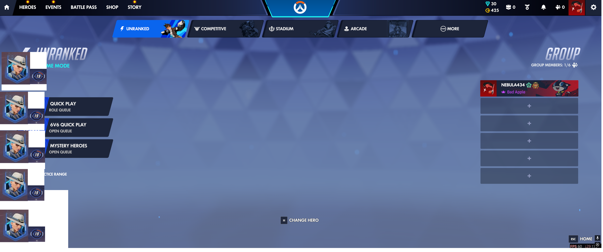
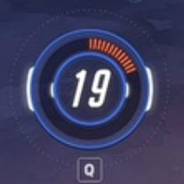
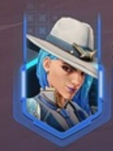

<div align="center">


<a href="https://git.io/typing-svg"></a>

<br/>


<br/><br/>

<b><a href="#overview">Overview</a></b> &nbsp;·&nbsp;
<b><a href="#features">Features</a></b> &nbsp;·&nbsp;
<b><a href="#quick-start">Quick start</a></b> &nbsp;·&nbsp;
<b><a href="#configuration">Configuration</a></b> &nbsp;·&nbsp;
<b><a href="#how-it-works">How it works</a></b> &nbsp;·&nbsp;
<b><a href="#roadmap">Roadmap</a></b> &nbsp;·&nbsp;
<b><a href="#credits">Credits</a></b>

</div>

---

## Overview

During hero select you rarely know how your teammates actually perform on the heroes they pick.
This overlay quietly answers that: it pins a small column of cards to the edge of your screen — one
per tracked teammate — each showing **who they play most** and **how often they win**, without ever
stealing focus from the game.

The window is **transparent, frameless, always-on-top, and click-through** (your mouse and keyboard
pass straight to Overwatch), with no taskbar entry. It starts hidden and is toggled with a global
hotkey, matching the intended "shown during hero select, hidden otherwise" behavior.

> [!NOTE]
> This is an **unofficial fan project**. It reads only **public** career-profile stats through a
> community API — no login, no API key, and nothing injected into the game.

### The ult-ring visual language

Each teammate is one **wide horizontal card**, laid out left to right:

<div align="center">

**`hero shield`** &nbsp;➜&nbsp; **`win-rate ring`** &nbsp;➜&nbsp; **`name / most-played hero`**

</div>

- **Win-rate ring** — a re-theme of the Overwatch ultimate-charge HUD ring. A full **donut** is split
  into a win arc and a loss arc (win % + loss % = 100 %), drawn as **50 segmented charge-ticks**
  (each tick = 2 %) with a dark seam where the arcs meet. The percentage sits **bold and italic** in
  the center, over a recessed track, a beveled cyan double-rim, and a soft glow.
- **Hero shield** — a framed **shield/badge** silhouette with a glowing cyan edge; the portrait is
  clipped to the shield. A missing or unknown hero falls back to an initial or `?` while keeping the
  same frame, so the layout never shifts.
- **Column** — cards stack in a single **non-overlapping** vertical column anchored to a screen
  corner (top-left by default), fading in top-down with a per-card stagger and a slow cyan glow that
  "breathes" at rest.

The ring fills $\textcolor{#6FD23A}{\textsf{green for wins}}$ and
$\textcolor{#E53935}{\textsf{red for losses}}$ — exactly like the orange ult charge, recolored.

> [!TIP]
> Every color, size, font, and timing lives in **one** theme module (`src/overlay/ui/theme.py`),
> copied verbatim from the spec in `DESIGN.md`. **Re-skinning the whole overlay means editing that
> single file** — never the logic.

<details>
<summary><b>HUD palette (the design tokens)</b></summary>

<br/>


</details>

---

## Features

| | |
|---|---|
| **Per-teammate cards** | most-played hero + overall win rate, one card each |
| **Ult-style win/loss ring** | 50 segmented ticks, green/red split, bold italic center % |
| **Shield hero portraits** | fetched and cached locally, with a graceful fallback glyph |
| **True click-through HUD** | transparent, always-on-top, never grabs game focus |
| **Global hotkeys** | configurable show/hide + quit, the manual hero-select trigger |
| **Configurable win-rate basis** | competitive-only, or competitive + quickplay combined |
| **Four anchor corners** | plus an adjustable refresh interval |
| **Configurable HUD font** | safe condensed fallback chain; nothing copyrighted bundled |
| **Non-blocking networking** | every API call runs off the UI thread |
| **Clean failure states** | `loading`, `ok`, `private / not found`, `network error` |

---

## Screenshots / Concept

> [!IMPORTANT]
> Live in-game captures are still to be added. The concept art below captures the target look — the
> win-rate ring is a recolor of the ult-charge ring (orange charge ➜ green win arc + red loss arc).

<div align="center">

<table>
<tr>
<td align="center"><b>Teammate card (concept)</b></td>
<td align="center"><b>Ult ring (inspiration)</b></td>
<td align="center"><b>Hero icon (inspiration)</b></td>
</tr>
<tr>
<td></td>
<td></td>
<td></td>
</tr>
</table>

</div>

---

## Quick start

```powershell
# 1. Clone, then create and activate a virtual environment
python -m venv .venv
.\.venv\Scripts\Activate.ps1

# 2. Install dependencies
pip install -r requirements.txt

# 3. Make your config and add some BattleTags
Copy-Item config.example.json config.json

# 4. Run
python -m src.overlay.main
```

The overlay starts **hidden**. Press the toggle hotkey during hero select to fade the column in;
press it again to fade it out.

<div align="center">

**Show / hide** &nbsp; <kbd>Ctrl</kbd> + <kbd>Alt</kbd> + <kbd>O</kbd> &nbsp;&nbsp;|&nbsp;&nbsp;
**Quit** &nbsp; <kbd>Ctrl</kbd> + <kbd>Alt</kbd> + <kbd>Q</kbd>

</div>

> [!WARNING]
> Each tracked player's **career profile must be public**
> (Overwatch ➜ Settings ➜ Social ➜ *Career Profile Visibility: Everyone*). A private or unknown
> profile renders a "Private / not found" card instead of stats.

**Requirements:** Python **3.11+**, **Windows** (the global hotkey uses `pynput`). Pinned runtime:
`PySide6==6.11.1`, `httpx==0.28.1`, `pynput==1.7.7`.

<details>
<summary><b>Troubleshooting</b></summary>

<br/>

- **The overlay never appears / the hotkey does nothing.** `pynput` may be missing. Without it the
  overlay can't bind a global hotkey, so it falls back to staying **continuously visible** instead.
  Re-install requirements inside the active venv.
- **Every card says "Private / not found".** The BattleTag is misspelled, or that profile isn't
  public (see the warning above). BattleTags are written `Name#1234` and queried as `Name-1234`.
- **No `config.json`.** The app falls back to `config.example.json` so it still runs out of the box —
  but it tracks the example tags until you create your own.

</details>

---

## Configuration

Edit `config.json` (copied from `config.example.json`):

| Field | Meaning | Default |
|---|---|---|
| `battletags` | Teammates to track, as `Name#1234` | — |
| `refresh_interval_seconds` | How often to refresh stats (minimum 15) | `60` |
| `anchor` | Screen corner: `top-left`, `top-right`, `bottom-left`, `bottom-right` | `top-left` |
| `winrate_basis` | `competitive`, or `combined` (competitive + quickplay) | `combined` |
| `font_family` | Optional font override; `null` uses the built-in HUD chain | `null` |
| `toggle_hotkey` | Global show/hide hotkey ([pynput format](https://pynput.readthedocs.io/en/latest/keyboard.html#monitoring-the-keyboard)) | `<ctrl>+<alt>+o` |
| `quit_hotkey` | Global quit hotkey | `<ctrl>+<alt>+q` |

---

## How it works

```mermaid
%%{init: {'theme':'base','themeVariables':{'primaryColor':'#1A1A2E','primaryTextColor':'#FFFFFF','primaryBorderColor':'#F99E1A','lineColor':'#F99E1A','secondaryColor':'#1A1A2E','tertiaryColor':'#4D4E53','fontFamily':'Segoe UI'}}}%%
flowchart LR
    CFG["config.json<br/>tracked BattleTags"] --> WK["refresh worker<br/>(QThread)"]
    WK -->|"async fetch"| API["OverFast API"]
    API --> SVC["stats_service<br/>most-played hero + win%"]
    SVC --> PS["PlayerStats"]
    PS --> CARD["player card<br/>shield + ult ring"]
    CARD --> WIN["overlay window<br/>transparent · click-through"]
```



- **Data** — for each BattleTag (`Name#1234` ➜ `Name-1234`) the app calls OverFast's
  `stats/summary` endpoint. Most-played hero = the hero with the most time played; win rate is either
  the competitive rate or a recomputed competitive + quickplay aggregate, per `winrate_basis`. A
  `404` means a private/not-found profile and renders the error card.
- **Hero art** — the hero key ➜ portrait map is fetched once and portraits are cached under
  `assets/heroes/`, so icons load instantly on later runs. A single HTTP client is reused.
- **Threading** — fetches run on a dedicated worker `QThread` and report back to the UI via Qt
  signals, so the overlay never blocks or stutters.
- **Styling** — all visual values are centralized in `src/overlay/ui/theme.py` (the single source of
  truth, mirroring `DESIGN.md`). Widgets reference tokens **by name only** — no hard-coded colors,
  sizes, or fonts anywhere else — so a redesign edits one file and never touches logic.

<details>
<summary><b>Project layout</b></summary>

```text
OverwatchOverlaybot/
  src/overlay/
    main.py               # entry point: window + refresh loop + global hotkeys
    config.py             # config.json loading, validation, and defaults
    data/
      models.py           # PlayerStats / CardState (plain, Qt-free data types)
      overfast_client.py  # thin httpx client for the OverFast endpoints
      stats_service.py    # raw API -> PlayerStats; hero portrait cache
      refresh_worker.py   # off-thread QThread worker emitting per-player results
    ui/
      theme.py            # ALL design tokens (the single source of truth)
      winrate_ring.py     # the segmented green/red ult-style ring
      hero_icon.py        # the shield hero portrait + fallback
      player_card.py      # one teammate card (icon + ring + labels)
      overlay_window.py   # transparent, click-through, always-on-top window
  concepts/               # reference / concept art driving the design
  config.example.json     # sample config (copy to config.json)
  requirements.txt        # pinned dependencies
  README.md               # concise quick-start (canonical install/run guide)
  DESIGN.md               # the visual spec + design-token table
```

</details>

---

## Roadmap

The core overlay is implemented and matches the design spec (token-centralized ring, shield icon,
non-overlapping card column, transparent click-through window, off-thread refresh, configurable
basis/font/anchor/hotkeys). Tracked next steps (see `ISSUES.md`):

- [ ] **In-app configuration screen** to add/remove/edit tracked BattleTags without hand-editing
  `config.json` — *planned; pending a design pass for its look.*
- [ ] **"Game-closed" stats view** showing your own profile (overall stats + top-N most-played
  heroes) when Overwatch isn't running — *planned; pending design + scope.*
- [ ] **Standardized empty-state copy** for the no-data card label — *minor; pending wording.*
- [x] **Reliable first-press hotkey toggle** on Windows (AltGr-aware, virtual-key matching).
- [x] **Synced idle glow** so the hero shield and the win-rate ring "breathe" together.

---

## Credits

- **[OverFast API](https://overfast-api.tekrop.fr)** by *TeKrop* — the unofficial, key-free Overwatch
  career-profile API this overlay reads from (mirroring Blizzard career profiles).
- **Blizzard Entertainment** — Overwatch, its HUD design, hero art, and the official UI typeface are
  property of Blizzard. This is an unofficial fan project, not affiliated with or endorsed by
  Blizzard.
- **Fonts** — the real Overwatch UI font is proprietary and is **not** bundled. The HUD look uses a
  free Overwatch-style replica (`Koverwatch`) when available, falling back through a condensed chain
  (Big Noodle Titling ➜ Bebas Neue ➜ Oswald ➜ Arial Narrow ➜ sans-serif). Override it via
  `config.json`.
- Built with **[PySide6](https://doc.qt.io/qtforpython/)** (Qt for Python),
  **[httpx](https://www.python-httpx.org/)**, and **[pynput](https://pynput.readthedocs.io/)**.

<div align="center">


<sub><b>Track current <code>DESIGN.md</code> · re-skin by editing one file · made for the spawn room.</b></sub>

</div>
